## Pokedevs Website

## 📝 | Project description
Pokedevs é um projeto criativo que combina o universo Pokémon com o mundo dos desenvolvedores. Cada Pokedev representa um Pokémon com habilidades de programação e desenvolvimento de software. Ao clicar em um botão correspondente a cada Pokedev, o usuário pode ver uma descrição única, detalhando suas especialidades e papel na equipe de desenvolvedores.

Pokedevs is a creative project that combines the Pokémon universe with the world of developers. Each Pokedev represents a Pokémon with programming and software development skills. By clicking on a button corresponding to each Pokedev, the user can see a unique description, detailing their specialties and role in the development team.

## ⚙ | Features
- Interface interativa com botões para cada Pokedev.
- Exibição de informações exclusivas sobre cada personagem.
- Design temático baseado no universo Pokémon, com uma pegada de desenvolvimento.

## 📚 | Stack

  
  
  

## 🛠 | Tools
- Visual Studio Code
- Google Fonts
- Responsive Viewer*
- CSS Scan*

**__Responsive Viewer__* é uma extensão web para facilitar a visualização e teste de sites responsivos. Permite exibir o layout em diferentes resoluções de tela simultaneamente, agilizando o processo de adaptação de interfaces para dispositivos variados.

**__Responsive Viewer__* is a web extension that makes it easier to view and test responsive websites. It allows you to display the layout in different screen resolutions simultaneously, speeding up the process of adapting interfaces to different devices.

**__CSS Scan__* é uma ferramenta prática que facilita a inspeção e cópia de estilos CSS diretamente de uma página da web. Eu utilizei essa ferramenta especificamente para criar o box-shadow no meu projeto, ajustando de forma rápida os parâmetros de sombra até encontrar o resultado ideal.

**__CSS Scan__* is a handy tool that makes it easy to inspect and copy CSS styles directly from a web page. I used this tool specifically to create the box-shadow in my project, quickly adjusting the shadow parameters until I found the ideal result.

## 🖥 | Previews
- Website
  
  

  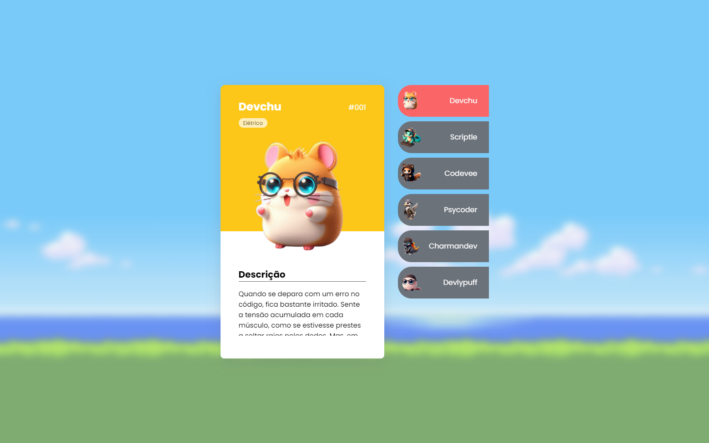
  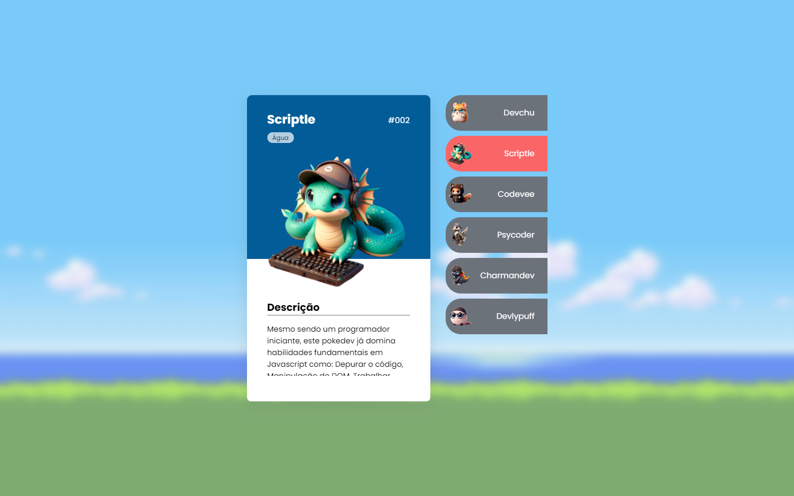
  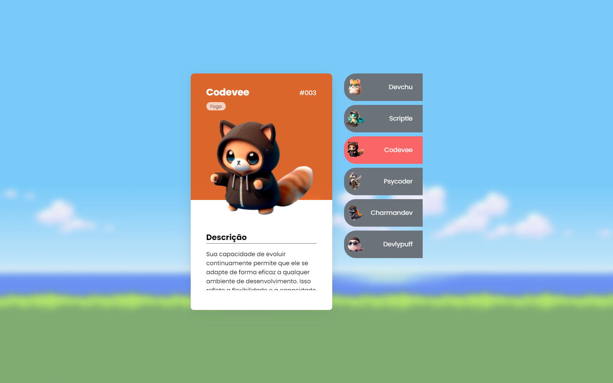
  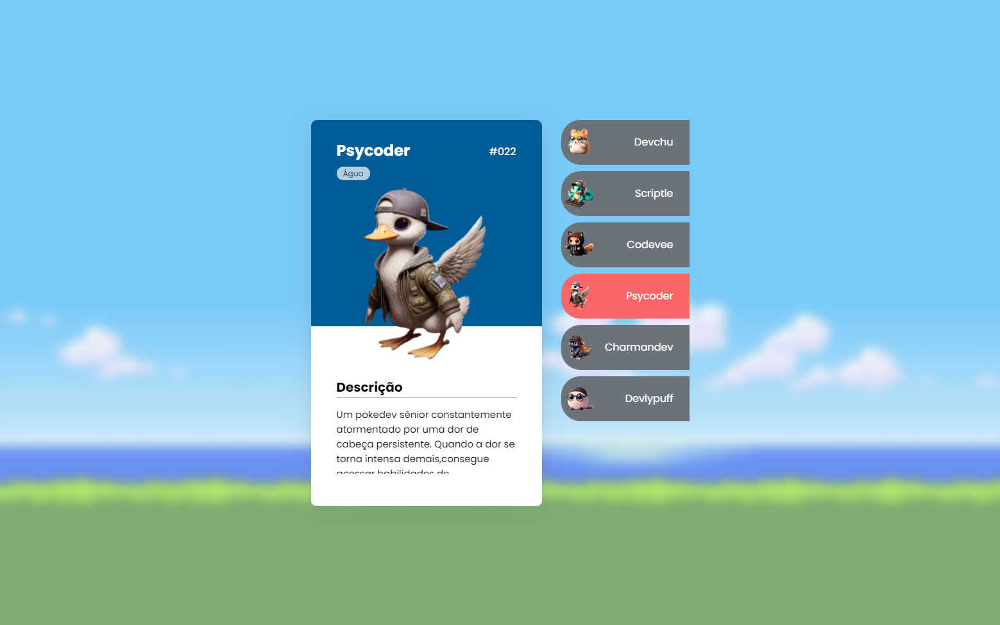
  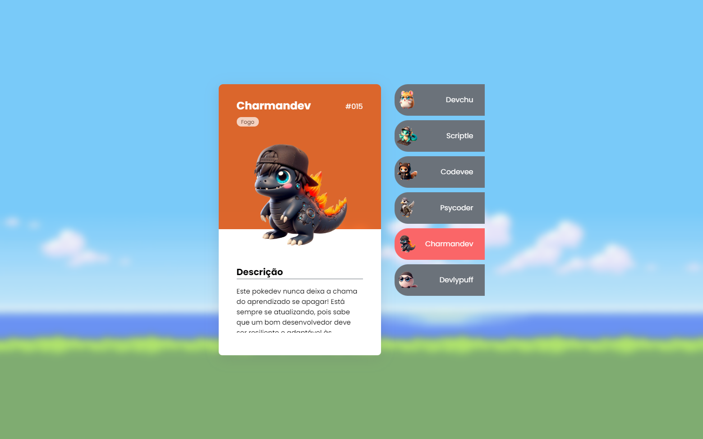
  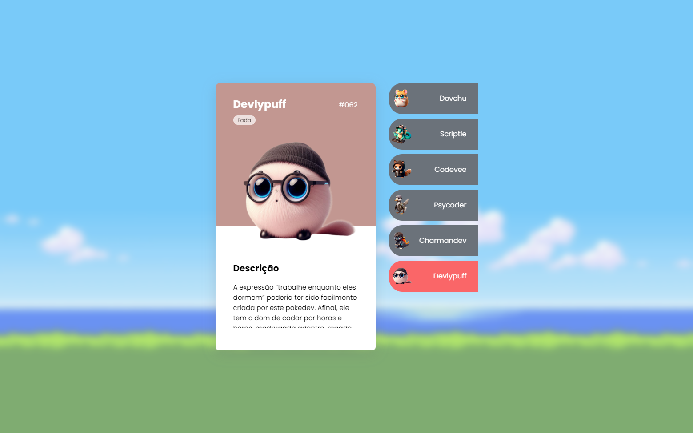

- Mobile

  

  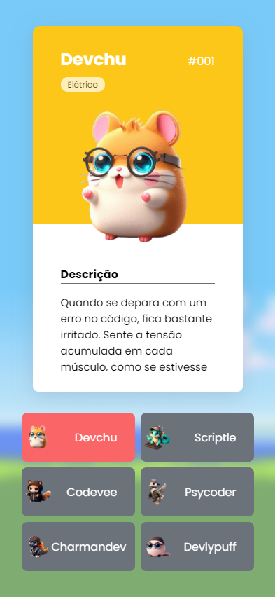
  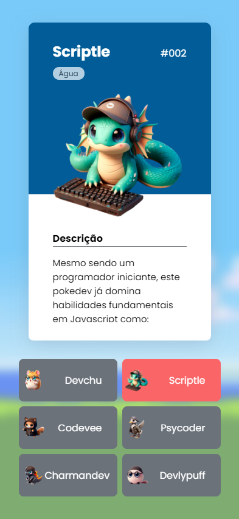
  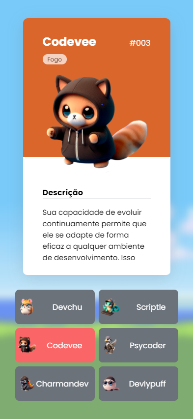
  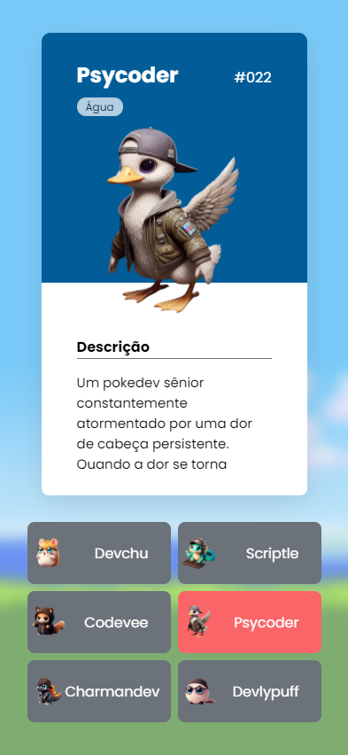
  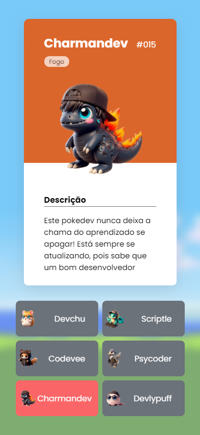
  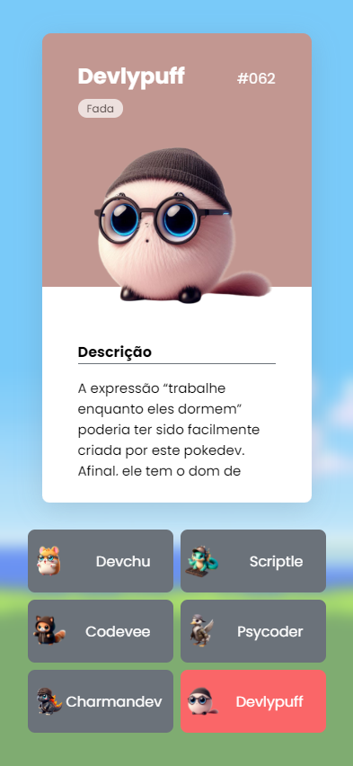

## 🌎 | Website
https://humphreysjulio.github.io/projeto-pokedevs/

## 👨‍💻 | Dev
- Julio César Humphreys Reis

